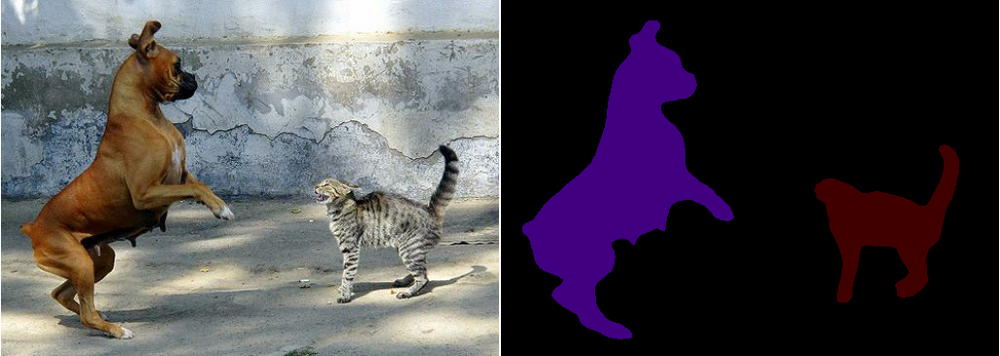

# About

This is an early stage of a project. The idea is to build a complete 3D vision "engine" using pretrained models to show the power and simplicity of deep learning for prototyping. It goes along with Dockerfile and Bash scripts to glue the pipeline steps.

Afterwards, this "engine" can be used to play around with navigation and planning in 3D.

# Usage

To run sample Jupyter notebook, use `make` command (with `notebook` recipe).

*Note: root is running the notebook, but shouldn't care much in this scenario.*

# Semantic segmentation + depth estimation

A sample image of objects classified per instance with additional distance information:

# Semantic segmentation

Collection of semantic segmentation samples from current state-of-the-art models.

## Instance segmentation

### 1. Mask RCNN - COCO dataset ([original](https://github.com/matterport/Mask_RCNN))

Sample collage:

## Class segmentation

### 1. DeepLabV3 ([original](https://github.com/tensorflow/models/tree/master/research/deeplab))

Test with arbitrary image: [test](https://colab.research.google.com/github/tensorflow/models/blob/master/research/deeplab/deeplab_demo.ipynb)

Sample images:

